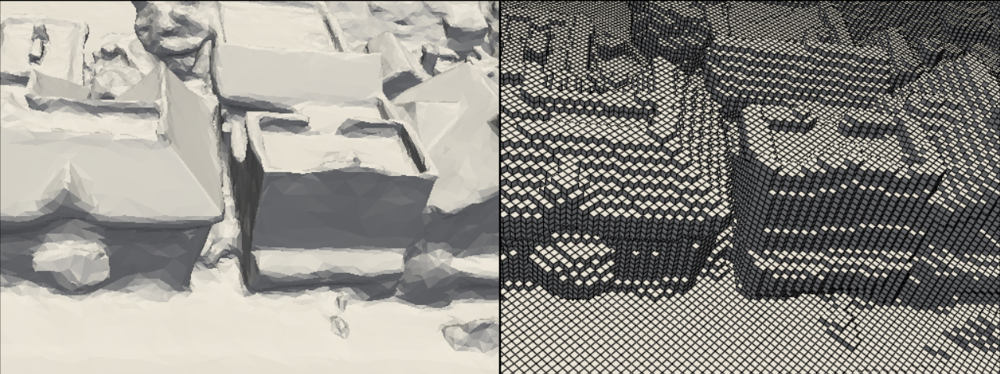
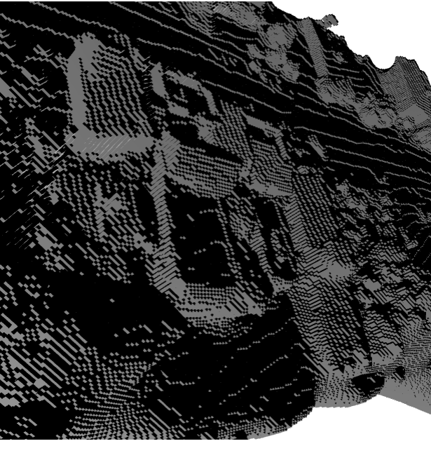
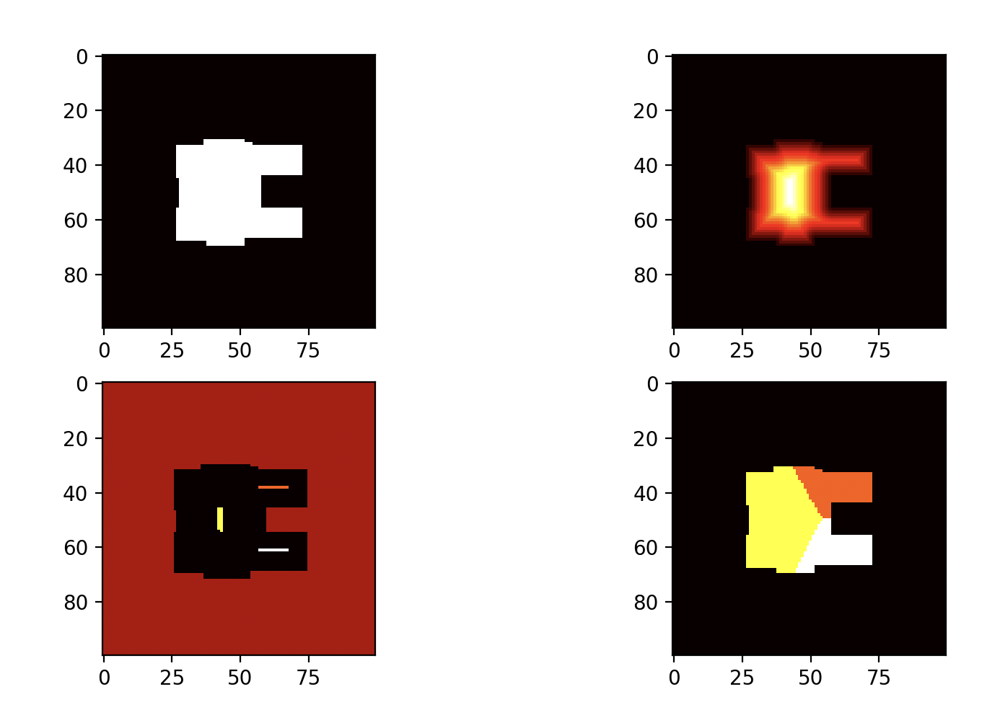
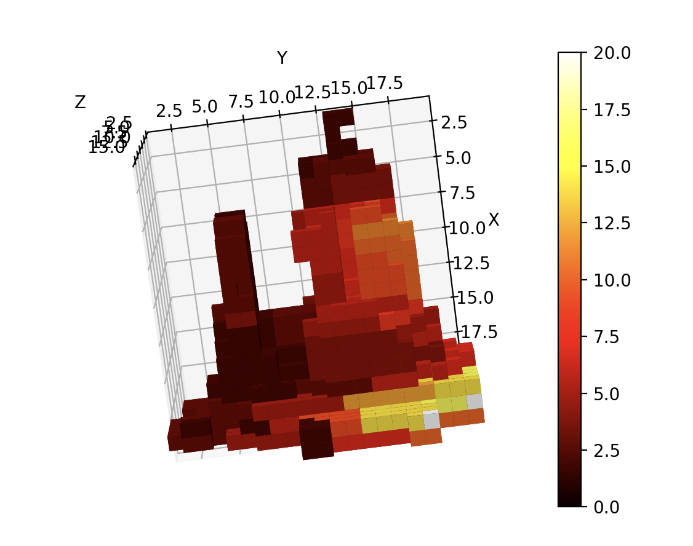
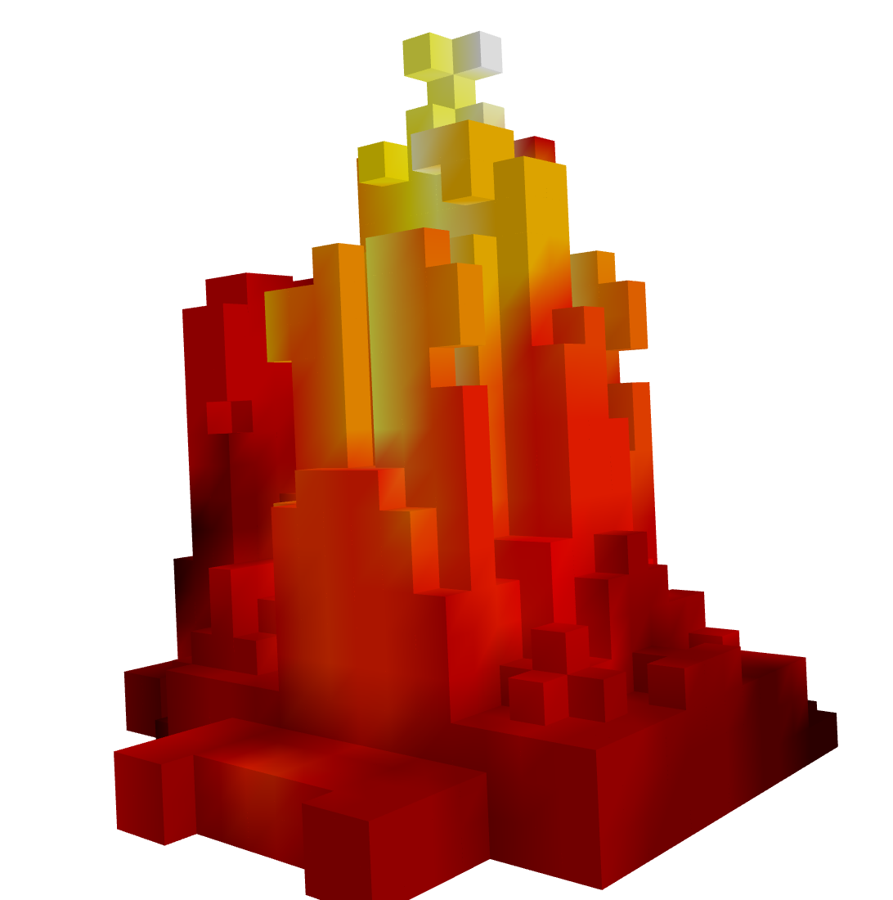
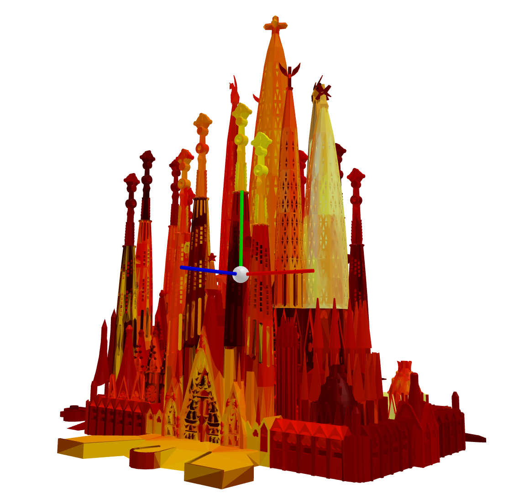

## Трансформация полигональных моделей в воксельные

| Скрипт | pyvista_voxelize.py | trimesh_voxelize.py | open3d_voxelize.py |
| ------ | ------ | ------ | ------ |
| Удалось запустить | да | да | да |
| Сложность алгоритма | - | - | - |
| Скорость посторения воксельной модели ```factory.ply``` (в мин.) | до 5 | до 1 | до 10 |
| Корректный результат на моделях ODM | да | да | да |
| Корректный результат на маленьких моделях | да | нет | да |
| Качество визуализации | отличная | нормальная | плохая |
| Минимальный размер вокселя, при котором получилось простроить модель | 0.005 | 0.005 | 0.05 |
| Потеря детализации модели | нет | нет | нет |
| Возможность преобразования модели с геометрическими ошибками (полой, или с дырками) | нет | да | да |
| Возможность анализа воксельной модели | да | да | да |
| Особенности | Очень хороший графический интерфейс | Запускается только в интерактивном меню в VS Code. Самая популярная из представленных библиотек | - |

### Пример преобразования pyvista с размером вокселя 0.005


### Пример преобразования trimesh с размером вокселя 0.005


## Сегментация воксельных моделей

1. Библиотека [MeshLib](https://github.com/MeshInspector/MeshLib). В README библиотеки указана поддержка "полу-автоматической сегментации" воксельных моделей. Opensorce бибиотека, написана на C++, но есть интерфейс в виде библиотеки на python.
2. Статья [Распознавание композиционной структуры 3D-моделей зданий с помощью объемного анализа](https://ieeexplore.ieee.org/document/8370623). Подробно описывается алгоритм структурной сегментации воксельных 3d моделей зданий.

## Собственная реализация [алгоритма сегментации](https://ieeexplore.ieee.org/document/8370623) воксельных моделей

1. Первым этапом был реализован алгоритм сегментации одного слоя здания (скрипт segment_one_layer.py).

### Результат сегментации одного слоя


Результат сегментации следует понимать слева направо сверху вниз:
Первое изображение - исходный слой здания.
Второе - Карта Евклидового расстояния. Чем ближе цвет пикселя к белому, тем дальше этот пиксель находится от границ.
Третье - По максимальным значениям в карте из предыдущего пункта находятся средние вершины и сегментируются уникальными цветами.
Четвёртое - Остальные пиксели на слое присваиваются ближайшему максимуму. Конечный результат.

2. Алгоритм сегментации одного слоя был прогнан для каждого слоя 3d модели (скрипт segment_3d_model.py).

### Результат сегментации 3d модели


Необходимые доработки по данному этапу:
а) Сливать близко лежащие друг к другу максимумы в один на одном слое.
б) Реализовать алгоритм слияния прилегающих друг к другу сегментированных слоёв.
в) Возможно, улучшить алгоритм сегментации слоя.

## Показать результаты сегментирования на исходной модели
Результатом сегментации 3d модели является трёхмерный массив с целыми числами, где уникальное число отображает, к какому сегменту относится воксель. 
С помощью функции нормализации можно привести этот массив к float значениям от 0 до 1, и преобразовать эти значения в heatmap.
Получившийся heatmap, отражающий сегменты, можно натянуть на вокселизированную (но всё ещё полигональную) 3d модель библиотеки Trimesh.

### Вокселизированная полигональная 3d модель с отражёнными сегментами


Теперь из этой вокселизированной полигональной 3d модели можно получить цвета вершин этой полигональной модели.

Полученный массив цветов вершин необходимо расширить до размера вершин исходной полигональной модели, путём интерполирования. После интерполирования можно отобразить сегменты уже на исходной модели.

### Исходная полигональная 3d модель с отражёнными сегментами


Необходимые доработки по данному этапу:
а) Есть подозрение, что системы координат у массива с сегментами и исходной полигональной модели не совсем совпадают и, следовательно, сегменты на исходной модели смещены.
